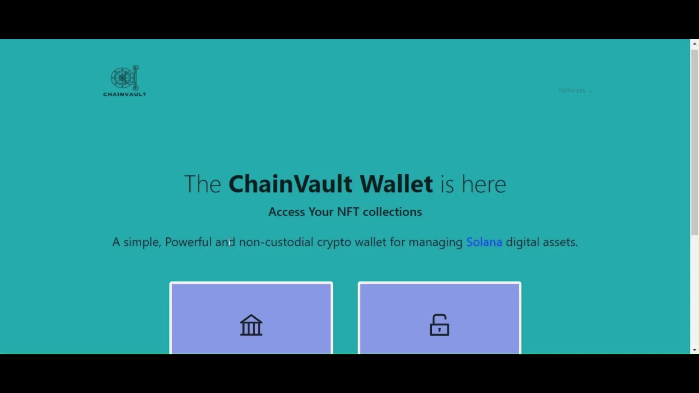
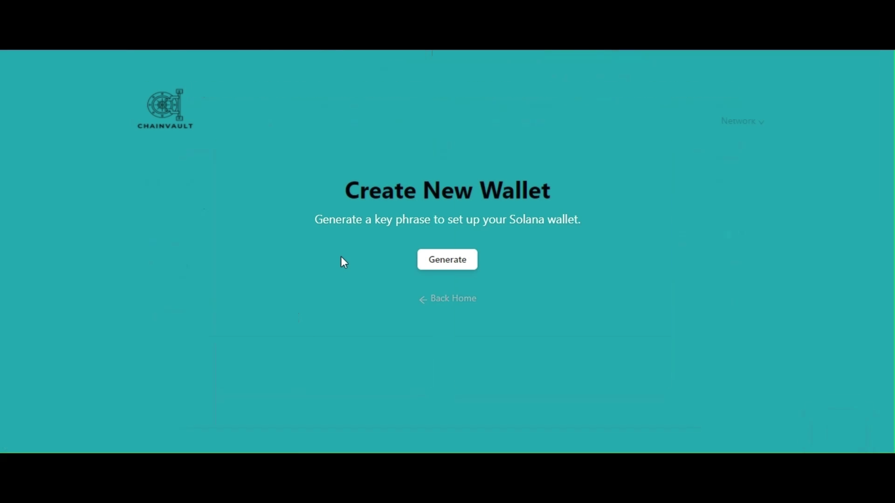
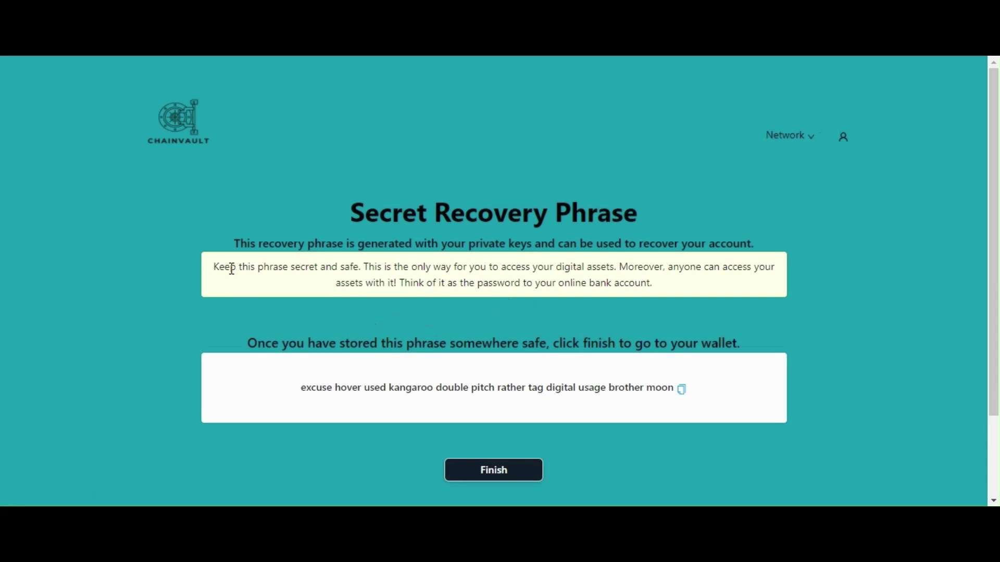
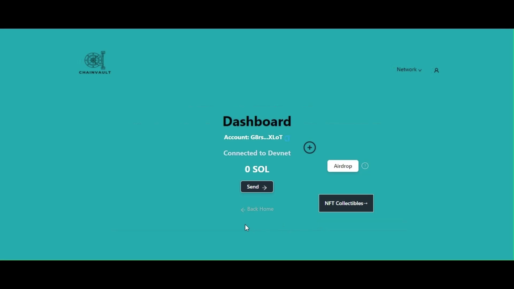
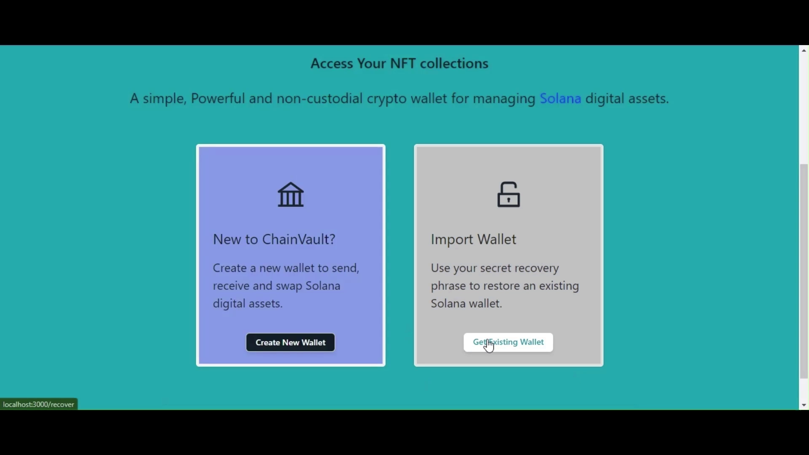
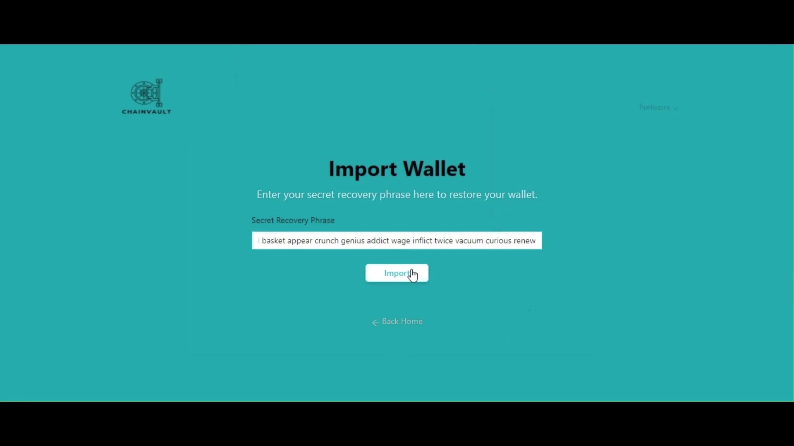
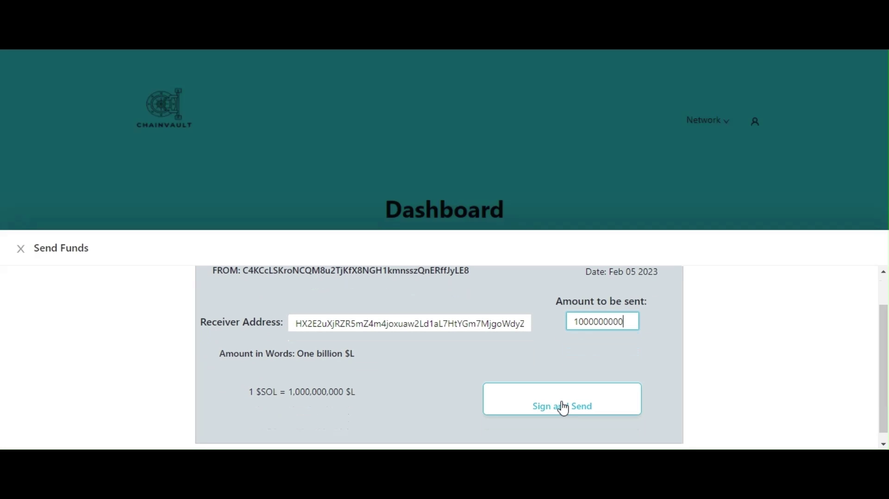
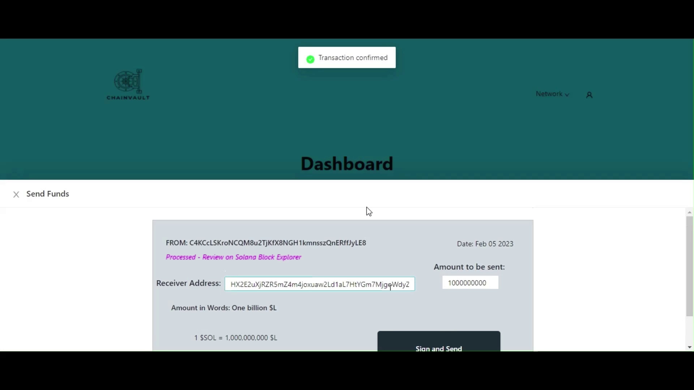
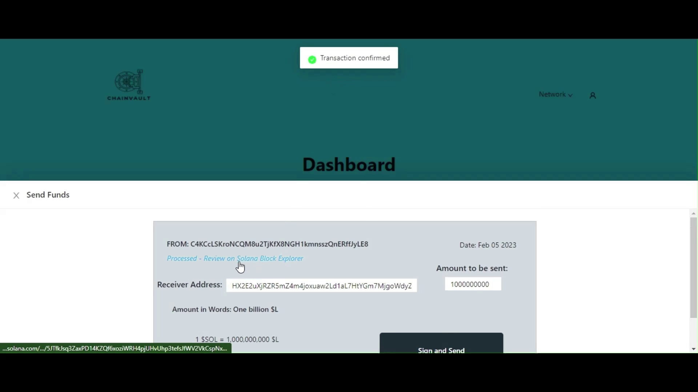

# ChainVault - Solana Encode Hack

<p align="center">
    <a href="./README.md"><strong>Explore the docs »</strong></a>
    <br />
    <a href="./public/ChainVault_Presentation.mp4">View Demo</a>
  </p>

  <details>
  <summary>Table of Contents</summary>
  <ol>
    <li>
      <a href="#What-is-the-ChainVault">What is the ChainVault</a>
      <ul>
        <li><a href="#Problem">Problem</a></li>
        <li><a href="#Solution">Solution</a></li>
      </ul>
    </li>
    <li>
      <a href="#getting-started">Getting Started</a>
      <ul>
        <li><a href="#prerequisites">Prerequisites</a></li>
        <li><a href="#System_Dependencies">System Dependencies</a></li>
        <li><a href="#installation">Installation</a></li>
        <li><a href="#How_the_Project_works">How the Project works</a></li>
        <li><a href="#Team_members">Team Members</a></li>
      </ul>
    </li>
    <li><a href="#Upcoming_Features">Upcoming Features</a></li>
    <li><a href="#Bugs">Bugs</a></li>
  </ol>
</details>


<br>

## 🤔 What is the `ChainVault`?

ChainVault is a decentralized application that creates a gateway into crypto ecosystems by enabling users to interact with Solana blockchain protocols and manage their digital assets.

Under the hood, ChainVault leveraged cryptographic technologies to generate and recover private keys - The private keys give users access to public accounts that record ownership on the Solana blockchain and expand the internet's functionality from a global network for information exchange to a global network for disintermediated economic exchange.
<br>

## 🔴 Problem

Custodial wallets are types of cryptocurrency wallets where the private keys are managed and stored by third-party service providers. That means the user does not have full control over their funds as they are stored by a third-party which are not the perfect go-to for lifetime digital assets. Non-custodial wallets, on the other hand, give users full control over their private keys and funds, as the keys are stored locally on the user’s device and not a central server. This eliminates the risk of funds being stolen or lost due to hacking or mismanagement by the service providers.
<br>

## 🟢 Solution

Custodial wallets are types of cryptocurrency wallets where the private keys are managed and stored by third-party service providers. That means the user does not have full control over their funds as they are stored by a third-party which are not the perfect go-to for lifetime digital assets. Non-custodial wallets, on the other hand, give users full control over their private keys and funds, as the keys are stored locally on the user’s device and not a central server. This eliminates the risk of funds being stolen or lost due to hacking or mismanagement by the service providers.
<br>
<br>

## 🧑‍💻 Getting started

<hr>

## 🛠️ Prerequisites

<li><a href="https://typescriptlang.org">Typescript</a></li>
<li><a href="https://reactjs.org">React</a></li>
<li><a href="#prerequisites">Nextjs</a></li>
<li><a href="https://solana.com">Solana Web3js library</a></li>
<br>

## ⚙️ System Dependencies

<li><a href="https://nodejs.org">Node</a></li>
<li><a href="https://yarnpkg.com">Yarn</a></li>
<br>

## 💻 Installation

Start the Next.js development server on the default port 3000 with:

```
npm install
```

```
npm run dev
```

or

(Recommended) Start the Next.js development server on the default port 3000 using Yarn:

```
yarn install
```

```
yarn dev
```

> Alternatively, run `npm run dev -p 8080` or any port other than `8080` to start the server in a different port.

Once the server is running, you should see output that looks like this:

```


$ next dev
ready - started server on 0.0.0.0:3000, url: http://localhost:3000
info - Using webpack 5. Reason: Enabled by default https://nextjs.org/docs/messages/webpack5
event - compiled successfully

```

<br>

## How the Project works

**Creating Wallet:** The user clicks on the create wallet button.<br>
<br>


```
then, it takes the user to a new page where he/she generates his/her wallet key by clicking on the generate button.
```


<br>

```
then, it takes the user to a new page where he/she sees his/her wallet mnemonics key phrase and makes sure they copy there mnemonics key phrase to a secret location before moving to the next page.
```


<br>

```
lastly, it takes the user to a new page showing the user their account dashboard where they could add tokens, recieve funds and digital assets like NFT for the developement
```


<br>

<hr>
<br>

**Restoring Wallet:** The user clicks on the Get Existing wallet button.
<br><br>


```
then, it takes the user to a new page where he/she inputs their mnemonic keys phrase of their account then click on import.
```


<br>

```
then, it takes the user to a new page where it shows the user has succesfully log into their accounts else it fails.
```


<br>

```
then, on the user's dashboard there is an airdrop button used to fund their wallet by clicking on it to get 1 SOL token.
```


<br>

```
From here, the user can make transactions with his/her accounts. For example to transfer funds to a user. The sender clicks on the send button
```


<br>

```
then, the sender inputs the recievers address and amount
```


<br>

```
then, the sender clicks on sign and send to initiate transfer
```


<br>

```
lastly, the sender recieves a transaction successful notification and clicks on the review link to see the transaction on Solana block explorer
```


<br>

## 🙍‍♂️ Team Members

<li>Abdulazeez Salihu (Backend Developer)</li>
<li>Ibisomi Teslim (Frontend Developer)</li>
<li>Alade Toheeb (Product Manager)</li>
<br>

## 🔜 Upcoming Features

<li>Nft Marketplace</li>
<li>Teleport Tokens (Token Bridge)</li>
<li>Adding of multiple Tokens</li>
<li>Dapp Browser</li>
<br>

## 🪲 Bugs

<li>Lamport Conversion on transfer</li>
